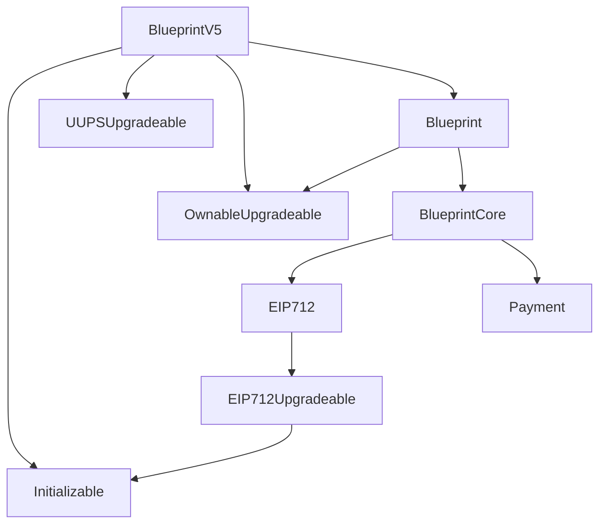

Clever Charcoal Moth

Medium

# Corruptible storage pattern

### Summary

The inheritance of the `Blueprint` contract is quite complex, with extending multiple upgradeable contracts. The lack of `_gap` would make future upgrades corrupt storage state.

### Root Cause

Here is the inheritance graph of the protocol:

For the complex inheritance, any upgrades to contracts in the middle will potentially break the storage state, due to lack of `_gap`

### Internal Pre-conditions

N/A

### External Pre-conditions

N/A

### Attack Path

N/A

### Impact

Storage will be corrupted when contracts are upgraded

### PoC

_No response_

### Mitigation

Add `_gap` to `EIP712`, and `BlueprintCore` contract.