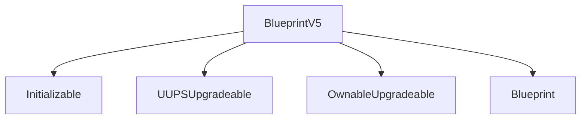
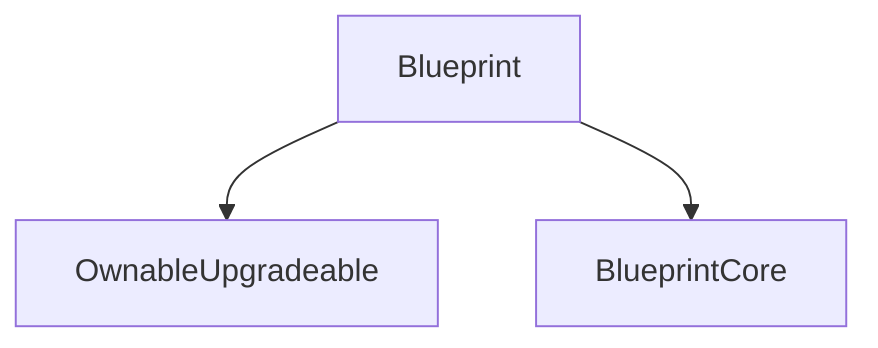
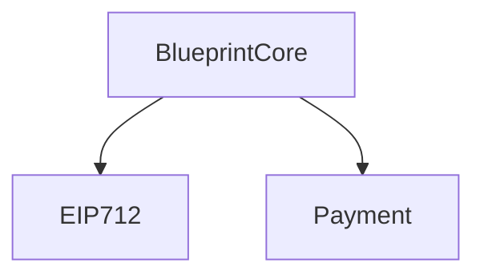
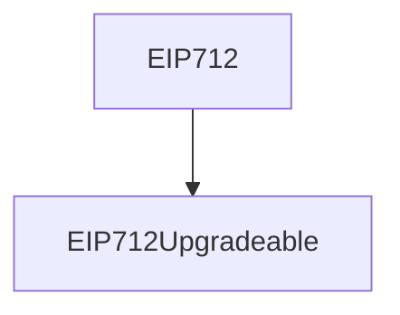

Loud Blonde Raven

Medium

# Admin might introduce unsafe upgrades for BlueprintV5 contract

### Summary

The [BlueprintV5](https://github.com/sherlock-audit/2025-03-crestal-network/blob/main/crestal-omni-contracts/src/BlueprintV5.sol#L10-L11) contract is designed to be UUPSUpgradeable. However, the current implementation has multiple issues that make it unsafe for upgrades.


### Root Cause


The following is the inheritance chain of BlueprintV5:

### **BlueprintV5 Inheritance Chain**


### **Blueprint Inheritance Chain**


### **BlueprintCore Inheritance Chain**


### **EIP712 Inheritance Chain**


While `EIP712` correctly inherits `EIP712Upgradeable` from OpenZeppelin, ensuring upgrade safety, there are still other concerns:

1. **Lack of Storage Gaps:**
   - Contracts that contain storage variables, such as `BlueprintCore`, should include storage gaps to allow for future upgrades without storage collision issues.

2. **Missing Initializer Disabling in Constructor:**
   - The contract does not disable initializers in its constructor, which is a best practice for proxy contracts.

#### Missing Initializer Disabling Example:
```solidity
  constructor() {
    _disableInitializers();
  }
```

Without this, an attacker could deploy the implementation contract and initialize it with malicious data before it is used as a proxy.

### Internal Pre-conditions

1. Admin attempts an upgrade without ensuring storage slot alignment in `BlueprintCore`.
2. Lack of storage gaps can cause new variables to overwrite existing ones during upgrades.

### External Pre-conditions

N/A

### Attack Path

N/A

### Impact

1. **Storage Corruption During Upgrade:**
   - If an upgrade adds new storage variables in `BlueprintCore` without proper alignment, existing variables may be corrupted, leading to unexpected behavior or contract failure.
2. **Potential Unauthorized Initialization:**
   - Without `_disableInitializers()`, an attacker could pre-initialize the contract with malicious settings before it is used in a proxy setup.

### PoC

N/A

### Mitigation

1. **Add Storage Gaps in BlueprintCore:**
   - Introduce reserved storage slots in `BlueprintCore` to accommodate future variables.
   ```solidity
   uint256[50] private __gap;
   ```
Or consider using [Namespaced Storage Layout](https://docs.openzeppelin.com/upgrades-plugins/writing-upgradeable#namespaced-storage-layout)
2. **Ensure Proper Usage of Upgradeable Contracts:**
   - Verify that all inherited contracts use their upgradeable versions where applicable.

3. **Disable Initializers in Constructor:**
   - Add `_disableInitializers();` to the constructor to prevent unauthorized initialization.