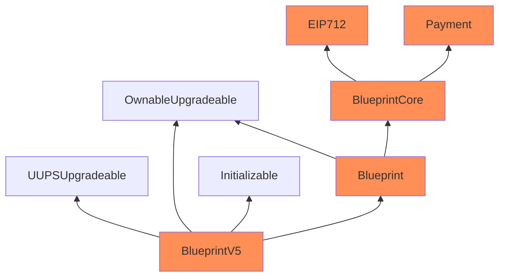

Warm Basil Yak

Medium

# Corruptible contract's upgradeability

### Summary

This diagram shows how `BlueprintV5`, `Blueprint`, `BlueprintCore` and `Payment` contracts inherit from each other. These contracts lack storage gap, this issue might lead to corruptible upgradeability.

Contracts in orange are missing a storage gap, which could cause issues with upgrades:

https://github.com/sherlock-audit/2025-03-crestal-network/blob/27a3c28155702b3a68f29347efedffb048010e33/crestal-omni-contracts/src/BlueprintV5.sol#L10
### Root Cause

. 

### Internal Pre-conditions

.

### External Pre-conditions

.

### Attack Path

.

### Impact

lack of storage gap can lead to corruptible upgrades.

### PoC

_No response_

### Mitigation

Consider adding `uint256[50] __gap;` inside related contracts.